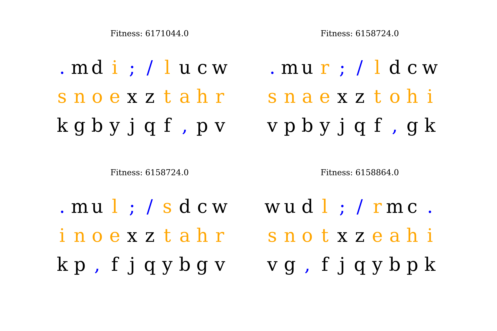

# ⌨️
## Optymalny layout klawiatury
Dawid Karpiński, 22.01.2024 r.

---

# 1. Kodowanie

- kodowanie haploidalne
- gen: pojedynczy znak
- chromosom: siatka 2d znaków na klawiaturze

---

# 2. Selekcja

dystans pokonany przez palce liczony na podstawie tekstu **"Makbet"** *(85 400 znaków)*

---

---

## Funkcja dopasowania

$$
f(\text{layout}) = \sum_{\braket{i,j}} d_{ij} + (d_{ij})^2 + (F_i)^2
$$

- $d_{ij}$ - odległość między znakami $i$ i $j$
- $F_i$ - użyty palec (0 - wskazujący, ..., 3 - mały)

---

## Porównanie

- $f(\text{QWERTY}) = 25\,231\,762$
- $f(\text{Dvorak}) = 15\,610\,313$

---

# 3. Krzyżowanie: OX

- wybór dwóch rodziców metodą ruletki
- kopiowanie losowo wybranej połowy klawiatury
- dopełnienie pozostałymi znakami

---

# 4. Mutacja

zamiana miejscami dwóch wybranych znaków

---

# 5. Elitaryzm

- sortowanie populacji według dystansu (rosnąco)
- 1/3 populacji przechodzi do następnej generacji

---

# 6. Wyniki

- liczebność populacji: 30
- liczba generacji: 1000

---

---

---

---

# Dziękuję za uwagę
